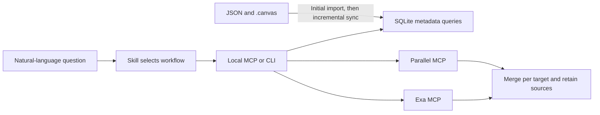

# Bookmark Research

[](#client-support) [](#client-support) [](#client-support) [](#client-support)

Query your [Bookmark Canvas](https://github.com/Browser-bookmark-hub/Bookmark-Canvas) data package in natural language, preserve its folder and card context, and research multiple targets through Exa and Parallel. **Codex, Claude Code, Pi, and DSH** share the same Skill and Python runtime, with a separate integration for each client.

Start with the **[installation guide](docs/installation.md)** for repository or standalone ZIP setup, commands for each client, a first query, and updates. You can follow the guide yourself or give this README to your agent. GitHub Releases are an optional download channel.

## Install in Codex

```sh
codex plugin marketplace add kwenxu/Bookmark-Research --ref main
codex plugin add bookmark-research@bookmark-research
```

For **Claude Code, Pi, DSH**, or a downloaded ZIP, follow the [installation guide](docs/installation.md). The repository includes the Codex marketplace at [`.agents/plugins/marketplace.json`](.agents/plugins/marketplace.json).

## Included components

| Component | Included entry | Purpose |
| --- | --- | --- |
| **Skill** | [`skills/bookmark-research/SKILL.md`](skills/bookmark-research/SKILL.md) | Guides package reading, local queries, source verification, and research reports |
| **MCP server** | [`src/mcp_server.py`](src/mcp_server.py), started with `python3 src/cli.py serve` | One local `bookmark-research` server with [nine tools](#mcp-tools) |
| **Python CLI** | [`src/cli.py`](src/cli.py) | Runs the same queries and research workflows directly, including from Pi |
| **Web providers** | [`config/providers.json`](config/providers.json) | Exa and Parallel connections used inside the MCP server or CLI |
| **Client integrations** | Native Codex manifest and [`scripts/export_bundle.py`](scripts/export_bundle.py) | Packages or adapters for Codex, Claude Code, Pi, and DSH |

The runtime requires Python 3.9+ and SQLite with FTS5; `doctor` checks these requirements. It uses the Python standard library and does not require a separate database service.

## Client support

| Client | Skill | MCP / CLI | Plugin or package entry | Verification |
| --- | --- | --- | --- | --- |
| **Codex** | Included | MCP | ✓ Native [`.codex-plugin/plugin.json`](.codex-plugin/plugin.json) | Actual MCP calls verified in Codex CLI 0.153.4 |
| **Claude Code** | Included | MCP | ✓ `--format claude`: `.claude-plugin/plugin.json` + `.mcp.json` | Export and shared runtime checked; client loading pending |
| **Pi** | Included through `pi.skills` | CLI | ✓ `--format pi`: Skill package with `package.json` | Export and shared runtime checked; client loading pending |
| **DSH / DeepSeek Harness** | Configure Skill discovery separately | MCP through the official client | ✓ `--format dsh`: local `cordis.patch.yml` adapter | Export and shared runtime checked; client loading pending |

✓ indicates an implemented package or adapter. Pi uses the Skill to call the CLI; it has no bundled MCP bridge or native tool extension. DSH requires `@deepseek-ai/dsh-mcp-client` and separate Skill discovery setup; its patch contains absolute paths and must be generated at the final installation location.

**Agent Plugins 1.0.0** is also available as a separate standard export: root `plugin.json` + `mcp.json`. It is a package format, not another client or the Codex native manifest. See [export formats](#export-formats) for commands and the [compatibility notes (Chinese)](docs/harness-compatibility.md) for first-party references and verification boundaries.

## Data and query model

Use packages that follow the Bookmark Canvas JSON schema. The plugin ships without bookmarks, registered sources, or a seed database. You provide the package path and research targets; a fresh data directory has no sources until the first `sync`.

**JSON / `.canvas` files are the source data; SQLite is a maintained, rebuildable query index.** The first import is complete, and subsequent syncs or queries check file changes and update the index incrementally. The same program handles repeated queries. There is no background file watcher.

The index keeps each object's latest synchronized state, not a date-queryable canvas history. After merging partial exports, rebuilding requires the original packages that cover all retained records. The most recent partial directory may be insufficient, so keep the relevant exports. Missing section files currently retain their old records; a full-snapshot mode that deletes missing sections is not implemented.



## Try it

In a session with the Skill loaded, ask:

> Analyze the bookmark package I provide. Search for the companies on my list and show which cards and folders contain them. Then use Exa and Parallel to find their official product information, combine the web results, and retain the sources.

For local queries, say "Search my bookmarks only; stay offline." For research, ask the agent to read key pages, investigate gaps, and save a report. The Skill and current model guide research depth.

You can also run the same CLI from this directory without installing a client plugin. Replace the package path, `my-canvas` source name, and fictional company names:

```sh
python3 src/cli.py doctor
python3 src/cli.py sync /absolute/path/to/your-package --source-id my-canvas
python3 src/cli.py search my-canvas --target 'Example Company A' --target 'Example Company B' --section A --limit 5
python3 src/cli.py context my-canvas --section A
python3 src/cli.py search-web --target 'Example Company A official products' --target 'Example Company B official products' --limit 5
```

See the [CLI reference (Chinese)](skills/bookmark-research/references/cli.md) for commands and multiple-target input. The default database is `~/.local/share/bookmark-research/index.sqlite3`, respecting `XDG_DATA_HOME`. Override it with `BOOKMARK_RESEARCH_DATA_DIR` or the global `--db` option. Clients can share an index by using the same path. Keep it outside the source package and plugin cache.

## Capabilities

| Feature | Current behavior |
| --- | --- |
| Local search | Titles, URLs, tags, notes, and folder paths; filters by card, group, or subfolder; independent pagination per target |
| Canvas context | `descriptionMd`, `slot`, `label`, shared trees for copy cards, ancestor paths, geometric group membership, and connection direction |
| SQLite sync | File hashes, stable IDs, section and canvas-entry renames, changed records, transactional rollback for invalid packages; retained records from partial exports are reported |
| Web search | Parallel Exa + Parallel queries, URL merging within each research target, RRF ranking, retained provider provenance, and visible partial failures |
| URL reading and archiving | Actual provider responses, recognized Markdown text, and source manifests; repeated reads add snapshots |
| Settings | View or change default providers, fetch length, and archiving through conversation; changes persist and take effect immediately |
| Skill workflows | Quick queries, iterative search, and extended research with references to saved evidence |

Local search uses literal matching and SQL structure filters. It has no semantic retrieval or public BM25 ranking, although FTS5 tables are maintained. The model organizes company names and aliases into queries; bookmark counts are not company-entity counts.

RAG is future work. This version has no embeddings, vector database, background page monitoring, or cross-session memory. Search results do not trigger a full-library crawl. Content read through `fetch_web` is archived by default; those archives are not a cross-source LLM Wiki.

## Duplicate bookmarks, context, and result merging

**The same URL or folder name can exist independently in different contexts.** The index identifies bookmarks and folders by `source_id + section_id + item_id`; it does not delete or merge them by title or URL. Distinct items in the same `.json` file remain separate, as do items in different sections or sources. A page stored under both "Learning / References" and "Work / References" remains two bookmarks with their own folder identities, paths, notes, and tags. Indexing does not modify the original JSON / `.canvas` files.

- **Counts:** `bookmarks` counts bookmark instances. `unique_urls` counts distinct original URL strings; it is a statistic and does not reduce the stored records. Reports should state which count they use.
- **Permanent copy cards:** a `copy-anchor` shares its main tree according to the data format. Adding a view does not double the global bookmark count. The copy card's description, position, groups, and connections remain available through `get_context`.
- **Web results:** when Exa and Parallel find the same page for one research target, the results are combined while retaining each provider and query that found it. This reduces repeated display and repeated ranking contributions; search hits are not independent factual evidence. Different `target` labels are merged separately. Use labels such as "Learning / Product docs" and "Work / Product docs" to research contexts separately.

Duplicate item IDs within one section are identity conflicts and cause import failure with rollback. Distinct items sharing a name or URL are valid.

## Settings and page archives

Ask "Show the plugin settings," "Use only Exa for future searches," "Save page text to my knowledge directory," or "Read this page without archiving." The model uses `get_settings`, `update_settings`, or parameters for the current `fetch_web` call. There is no separate graphical settings page.

The default configuration file is `~/.config/bookmark-research/settings.json`, created on the first update. Page archives default to `~/.local/share/bookmark-research/knowledge/`; XDG and plugin data-directory environment variables are respected. You can choose your own absolute paths. These files live outside the plugin and canvas package, so plugin updates do not replace them.

Each fetch creates a snapshot directory: `response.json` stores the actual MCP response; `manifest.json` records URLs, provider, fetch time, response and text hashes, and status; `pages/<URL-hash>.md` stores successfully recognized text. Publication dates and authors are recorded separately. Failures are kept out of page text. Conflicting responses for the same URL are retained and marked. Missing content is not fabricated, excerpts and unknown completeness are identified, and archive errors are returned with the fetch result. Later reads add snapshots without overwriting earlier ones.

```sh
python3 src/cli.py config show
python3 src/cli.py config set --search-provider exa --archive true
python3 src/cli.py fetch-web https://example.com --no-archive
```

See [settings and archives (Chinese)](skills/bookmark-research/references/settings-and-archive.md) for options, precedence, and archive structure. Automatic archiving applies to this plugin's `fetch_web` responses; it does not intercept other MCP tools in the host.

## Skill, MCP, and data rules

The [shared Skill](skills/bookmark-research/SKILL.md) guides the agent's workflow. The local **`bookmark-research` MCP server** executes queries and web operations. When a client uses the CLI, it runs the same underlying implementation.

### MCP tools

| Tool | Purpose |
| --- | --- |
| `index_status` | Inspect registered sources and index status |
| `sync_package` | Import a package or synchronize changes |
| `search_bookmarks` | Query bookmarks for multiple targets while retaining item context |
| `get_context` | Read section, card, group, connection, and item-ancestor context |
| `search_providers` | List configured web providers |
| `search_web` | Search through Exa / Parallel and merge results per target |
| `fetch_web` | Read known URLs and optionally archive responses and page text |
| `get_settings` | Read current settings and storage paths |
| `update_settings` | Update persistent settings |

### Web providers

| Provider or service | Integration |
| --- | --- |
| **Exa** | Built into the MCP server and CLI for search and URL reading |
| **Parallel** | Built into the MCP server and CLI for search and URL reading |
| **Tavily** | Optional host integration; results from a separately configured provider can be combined with `merge-results`. Automatic Tavily aggregation is not implemented. |
| **GitHub** | Use the host's existing GitHub MCP or `gh` for repository-specific tasks. No GitHub MCP is bundled; public pages can also be read through Exa / Parallel. |

Exa and Parallel run through the plugin's own MCP or CLI; you do not need to register two additional host MCP servers. Their public endpoints have been tested with real searches. Anonymous access and quotas depend on each service's current policy. When credentials are required, supply `EXA_API_KEY` / `PARALLEL_API_KEY` in the environment that launches the process. Local queries work without web providers.

### Package rules and AGENTS.md

Analysis rules are included in the Skill. The [package reading protocol (Chinese)](skills/bookmark-research/references/package-semantics.md) covers fields, metadata, A/B copies, chained sections, groups, connections, and counting. The [research workflow (Chinese)](skills/bookmark-research/references/research-workflow.md) covers web scope, evidence checks, and saved results. References retain their original guide sources and versions for future updates.

Routine analysis of supported formats does not require rereading the entire package `AGENTS.md`, and the runtime does not depend on it. Consult relevant original instructions for new formats, field conflicts, or package-specific conventions. Applicable directory instructions already loaded by the client still apply.

GitHub references and Git sync rules in a package's `AGENTS.md` do not automatically connect a GitHub service. See [GitHub and sync boundaries (Chinese)](skills/bookmark-research/references/github-and-sync.md).

The Skill currently produces answers and research reports. It does not generate importable bookmark packages or write changes back to source data. A future generation Skill could reuse the reading protocol with additional writing rules and validation.

## Export formats

This directory is the **Codex native plugin**, with its manifest at `.codex-plugin/plugin.json`. In Codex 0.153.4, the MCP configuration explicitly uses `cwd: "."` and runs `python3 src/cli.py serve` from the installed plugin directory. That native entry does not expand `${PLUGIN_ROOT}`; the Agent Plugins and Claude exports use their own path conventions.

The Codex manifest forwards these environment variable names through `env_vars`: `BOOKMARK_RESEARCH_DATA_DIR`, `BOOKMARK_RESEARCH_CONFIG`, `XDG_DATA_HOME`, `XDG_CONFIG_HOME`, `EXA_API_KEY`, and `PARALLEL_API_KEY`. Actual paths and credentials come from the user's runtime environment.

Run the relevant command **from this directory** to generate another format:

```sh
python3 scripts/export_bundle.py --format claude --output exports/claude/bookmark-research
python3 scripts/export_bundle.py --format pi --output exports/pi/bookmark-research
python3 scripts/export_bundle.py --format dsh --output exports/dsh/bookmark-research
python3 scripts/export_bundle.py --format agent-plugin --output exports/agent-plugin/bookmark-research
```

The destination must be new or empty. Exports include their own English README and exclude indexes, caches, tests, and credentials. The exporter writes files; follow the generated README or [installation guide](docs/installation.md) to load them in your client.

- **Claude Code:** `.claude-plugin/plugin.json` + `.mcp.json`; load with `claude --plugin-dir <export-directory>`.
- **Pi:** `package.json` declares `pi.skills`; the shared Skill calls the bundled CLI.
- **DSH:** a local configuration patch for the official MCP client, with the export's absolute path. Configure Skill discovery separately and regenerate paths if the directory moves. A relocatable `dsh.bundle` package is not provided.
- **Agent Plugins 1.0.0:** root `plugin.json` + `mcp.json`, for clients implementing that specification; generated separately from Codex's native manifest.

See the [client support table](#client-support) for verification status and [compatibility notes (Chinese)](docs/harness-compatibility.md) for format differences and official sources.

## Development verification

The full repository's `tests/` directory contains automated checks for importing, context retention, synchronization, and web protocols. Users do not need to run these tests to install or use the plugin. Standalone ZIPs and client exports exclude developer tests; the runtime uses `src/`.

From this plugin directory **in a full repository checkout**, developers can run:

```sh
python3 -m unittest discover -s tests -v
python3 scripts/verify_live.py --output /absolute/path/outside-your-package
```

The first command uses fictional packages generated by the tests. It checks imports, incremental sync, protocols, exports, and result merging offline without reading anyone's bookmark library. The second command makes real web requests for two public topics, reads one official documentation page, and saves inspectable JSON evidence.

The local stdio server exposes a fixed set of tools rather than arbitrary SQL or shell execution. Its remote client covers selected providers' Streamable HTTP calls; it does not implement general OAuth, paginated tool discovery, reconnection, or a complete MCP client SDK.

## Origin and license

Originally developed in [Bookmark Canvas](https://github.com/Browser-bookmark-hub/Bookmark-Canvas), this repository maintains the standalone research plugin. The original [GPL-3.0 license](LICENSE) is retained.
