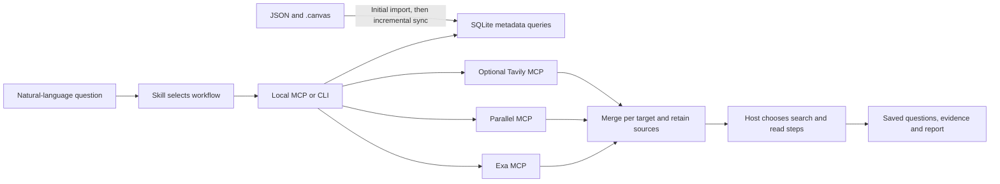

# Bookmark Research 0.2.0

[](#client-support) [](#client-support) [](#client-support) [](#client-support)

Query your [Bookmark Canvas](https://github.com/Browser-bookmark-hub/Bookmark-Canvas) data package in natural language, preserve its folder and card context, and research multiple targets through Exa, Parallel, and optional Tavily. **Codex, Claude Code, Pi, and DSH** share the same Skill and Python runtime, with a separate integration for each client.

**0.2.0** adds provider-specific MCP adapters, reusable sessions and capability discovery, durable deep research with retrieval budgets and checked quotations, and a CLI installer with update and verification commands. The agent still chooses each research step; saved tasks can be resumed in another session.

Start with the **one-command Codex installer below**, or the **[installation guide](docs/installation.md)** for other clients, a first query, and updates. The **[0.2.0 plugin ZIP](https://github.com/Browser-bookmark-hub/Bookmark-Research/releases/download/v0.2.0/bookmark-research-0.2.0.zip)** and **[test pack](https://github.com/Browser-bookmark-hub/Bookmark-Research/releases/download/v0.2.0/bookmark-research-test-pack-0.2.0.zip)** remain available as optional downloads. The [design research](docs/research-0.2.0.md) records the supplied research links and first-party sources; the [validation guide](docs/validation-0.2.0.md) provides reproducible checks.

## Install in Codex

With Bash, Git, Python 3.9+ with SQLite FTS5, and a Codex CLI that supports plugins:

```sh
curl -fsSL https://raw.githubusercontent.com/Browser-bookmark-hub/Bookmark-Research/main/install.sh | bash
```

The first install follows the repository's default branch, currently `main`. It fetches code directly from Git and delegates registration and verification to Codex's native plugin CLI; **no GitHub Release or ZIP download is required**. After installation, the terminal shows your effective settings, a first-use prompt, and a working command to view configuration. Start a new Codex thread to load the Skill and tools, then provide your own Bookmark Canvas package path.

**No configuration or API key is required for local bookmark queries.** The defaults use Exa + Parallel for web search, Exa for page reading, and automatic page archiving; web access depends on each provider's authentication and limits. Existing preferences are retained. See [first use and optional settings](docs/installation.md#首次使用与数据位置).

```sh
# Update the registered source, then verify it
curl -fsSL https://raw.githubusercontent.com/Browser-bookmark-hub/Bookmark-Research/main/install.sh | bash -s -- update

# Preview a first install; --help lists all options
curl -fsSL https://raw.githubusercontent.com/Browser-bookmark-hub/Bookmark-Research/main/install.sh | bash -s -- --dry-run
```

To pin a **first installation** to the stable version, append `-s -- install --ref v0.2.0` to `bash`. Repeat installs retain the registered ref; `update` refreshes that ref and does not switch a tag to a newer version. See [installation options](docs/installation.md#一条命令安装-codex) for source conflicts and existing personal installations.

From a **0.2.0 checkout or extracted ZIP**, local installation is also available:

```sh
python3 scripts/install.py install
python3 scripts/install.py verify
```

For a local source, run `python3 scripts/install.py update` after updating its files. [Native commands and Git sources](docs/installation.md#使用-codex-原生命令) are also documented.

For **Claude Code, Pi, DSH**, or a downloaded ZIP, follow the [installation guide](docs/installation.md). The repository includes the Codex marketplace at [`.agents/plugins/marketplace.json`](.agents/plugins/marketplace.json).

## Included components

| Component | Included entry | Purpose |
| --- | --- | --- |
| **Skill** | [`skills/bookmark-research/SKILL.md`](skills/bookmark-research/SKILL.md) | Guides package reading, local queries, source verification, and research reports |
| **MCP server** | [`src/mcp_server.py`](src/mcp_server.py), started with `python3 src/cli.py serve` | One local `bookmark-research` server with [16 tools](#mcp-tools) |
| **Python CLI** | [`src/cli.py`](src/cli.py) | Runs the same queries and research workflows directly, including from Pi |
| **Web providers** | [`config/providers.json`](config/providers.json) and [`src/provider_adapters.py`](src/provider_adapters.py) | Exa, Parallel and optional Tavily behind one MCP; schema checks, session reuse and visible partial failures |
| **Deep research** | [`src/research.py`](src/research.py) | Persistent brief, selected bookmark context, budgets, evidence, claims, conflicts and reports |
| **Client integrations** | Native Codex manifest, [`install.sh`](install.sh), [`scripts/install.py`](scripts/install.py) and [`scripts/export_bundle.py`](scripts/export_bundle.py) | One-command install/update/verify in Codex; separate packages or adapters for other clients |

The runtime requires Python 3.9+ and SQLite with FTS5; `doctor` checks these requirements. It uses the Python standard library and does not require a separate database service.

## Client support

| Client | Skill | MCP / CLI | Plugin or package entry | Verification |
| --- | --- | --- | --- | --- |
| **Codex** | Included | MCP | ✓ Native [`.codex-plugin/plugin.json`](.codex-plugin/plugin.json) | Install/update/verify and installed stdio tools checked using Codex CLI 0.153.4; see [validation](docs/validation-0.2.0.md) |
| **Claude Code** | Included | MCP | ✓ `--format claude`: `.claude-plugin/plugin.json` + `.mcp.json` | Export and shared runtime checked; client loading pending |
| **Pi** | Included through `pi.skills` | CLI | ✓ `--format pi`: Skill package with `package.json` | Export and shared runtime checked; client loading pending |
| **DSH / DeepSeek Harness** | Configure Skill discovery separately | MCP through the official client | ✓ `--format dsh`: local `cordis.patch.yml` adapter | Export and shared runtime checked; client loading pending |

✓ indicates an implemented package or adapter. Pi uses the Skill to call the CLI; it has no bundled MCP bridge or native tool extension. DSH requires `@deepseek-ai/dsh-mcp-client` and separate Skill discovery setup; its patch contains absolute paths and must be generated at the final installation location.

**Agent Plugins 1.0.0** is also available as a separate standard export: root `plugin.json` + `mcp.json`. It is a package format, not another client or the Codex native manifest. See [export formats](#export-formats) for commands and the [compatibility notes (Chinese)](docs/harness-compatibility.md) for first-party references and verification boundaries.

## Data and query model

Use packages that follow the Bookmark Canvas JSON schema. The plugin ships without bookmarks, registered sources, or a seed database. You provide the package path and research targets; a fresh data directory has no sources until the first `sync`.

**JSON / `.canvas` files are the source data; SQLite is a maintained, rebuildable query index.** The first import is complete, and subsequent syncs or queries check file changes and update the index incrementally. The same program handles repeated queries. There is no background file watcher.

The index keeps each object's latest synchronized state, not a date-queryable canvas history. After merging partial exports, rebuilding requires the original packages that cover all retained records. The most recent partial directory may be insufficient, so keep the relevant exports. Missing section files currently retain their old records; a full-snapshot mode that deletes missing sections is not implemented.



## Try it

In a session with the Skill loaded, ask:

> Analyze the bookmark package I provide. Search for the companies on my list and show which cards and folders contain them. Then use Exa and Parallel to find their official product information, combine the web results, and retain the sources.

For local queries, say "Search my bookmarks only; stay offline." For research, ask the agent to read key pages, investigate gaps, and save a report. For a longer investigation:

> Use the bookmarks in my selected group to compare these services. Save the selected bookmark context, break the comparison into research questions, investigate gaps and conflicting claims, and leave a report with traceable quotations and unresolved items. Preserve the task so I can continue later.

You can also run the same CLI from this directory without installing a client plugin. Replace the package path, `my-canvas` source name, and fictional company names:

```sh
python3 src/cli.py doctor
python3 src/cli.py sync /absolute/path/to/your-package --source-id my-canvas
python3 src/cli.py search my-canvas --target 'Example Company A' --target 'Example Company B' --section A --limit 5
python3 src/cli.py context my-canvas --section A
python3 src/cli.py search-web --target 'Example Company A official products' --target 'Example Company B official products' --limit 5
```

See the [CLI reference (Chinese)](skills/bookmark-research/references/cli.md) for commands and multiple-target input. The default database is `~/.local/share/bookmark-research/index.sqlite3`, respecting `XDG_DATA_HOME`. Override it with `BOOKMARK_RESEARCH_DATA_DIR` or the global `--db` option. Clients can share an index by using the same path. Keep it outside the source package and plugin cache.

## Capabilities

| Feature | Current behavior |
| --- | --- |
| Local search | Titles, URLs, tags, notes, and folder paths; filters by card, group, or subfolder; independent pagination per target |
| Canvas context | `descriptionMd`, `slot`, `label`, shared trees for copy cards, ancestor paths, geometric group membership, and connection direction |
| SQLite sync | File hashes, stable IDs, section and canvas-entry renames, changed records, transactional rollback for invalid packages; retained records from partial exports are reported |
| Web search | Concurrent providers, URL merging within each target, RRF ranking, provenance, schema checks, cached tool discovery, classified errors and per-call usage |
| URL reading and archiving | Actual provider responses, recognized Markdown text, and source manifests; repeated reads add snapshots |
| Settings | View or change default providers, fetch length, and archiving through conversation; changes persist and take effect immediately |
| Deep research | Durable sessions, selected bookmark context, enforced search/fetch budgets, idempotent operations, quoted claims, source review, conflicts, retractions and reports |

Local search uses literal matching and SQL structure filters. It has no semantic retrieval or public BM25 ranking, although FTS5 tables are maintained. The model organizes company names and aliases into queries; bookmark counts are not company-entity counts.

RAG is future work. This version has no embeddings, vector database, background page monitoring, or general conversational memory. Explicit research sessions can be reloaded by ID. Search results do not trigger a full-library crawl. Content read through `fetch_web` is archived by default; those archives are not a cross-source LLM Wiki.

## Three research modes

| Need | Workflow | Output |
| --- | --- | --- |
| Quick lookup | Read a known URL, or search once to discover it | A concise sourced answer |
| Agentic search | The host model plans queries, reads pages and follows evidence gaps | An answer based on iterative retrieval |
| Deep research | Save a brief and questions, execute bounded rounds, review sources and conflicting claims, synthesize | A resumable task with `context.json`, `report.md`, `sources.json` and evidence snapshots |

These modes follow the distinction in [OpenAI's web search guide](https://developers.openai.com/api/docs/guides/tools-web-search). Having a URL does not determine whether a model reasons. The plugin provides a host-led workflow; provider-native services such as Exa Agent or Parallel Task MCP are separate interfaces with separate authentication and lifecycle contracts.

Read the [deep research guide](skills/bookmark-research/references/deep-research.md) for MCP inputs and CLI examples. `research_start` persists the plan without network access. `research_search` and `research_fetch` reserve a retrieval budget before calling providers; repeating the same `operation_id` returns its recorded outcome. `research_source` reads saved text, and `research_record` associates exact quotations with findings and answers. A rejected source or retracted supporting claim reopens affected questions. `research_finish` refuses completion while questions or conflicts remain unresolved; `incomplete` produces a report with the remaining gaps.

Quotations and hashes prove what text was saved. The model must still check that the provider returned the right page and that its content supports the claim. A successful fetch may contain excerpts, stale text, or a mismatched page. Source review and retrieval failures remain visible in the report.

Active tasks can continue directly. After exporting an `incomplete` report, use `research_record` with `kind:"resume"` and a reason; prior reports are preserved, and retrieval budgets and operation IDs carry forward. Completed and cancelled tasks remain closed. Status returns bounded previews; use section pagination for complete records.

## Duplicate bookmarks, context, and result merging

**The same URL or folder name can exist independently in different contexts.** The index identifies bookmarks and folders by `source_id + section_id + item_id`; it does not delete or merge them by title or URL. Distinct items in the same `.json` file remain separate, as do items in different sections or sources. A page stored under both "Learning / References" and "Work / References" remains two bookmarks with their own folder identities, paths, notes, and tags. Indexing does not modify the original JSON / `.canvas` files.

- **Counts:** `bookmarks` counts bookmark instances. `unique_urls` counts distinct original URL strings; it is a statistic and does not reduce the stored records. Reports should state which count they use.
- **Permanent copy cards:** a `copy-anchor` shares its main tree according to the data format. Adding a view does not double the global bookmark count. The copy card's description, position, groups, and connections remain available through `get_context`.
- **Web results:** when Exa and Parallel find the same page for one research target, the results are combined while retaining each provider and query that found it. This reduces repeated display and repeated ranking contributions; search hits are not independent factual evidence. Different `target` labels are merged separately. Use labels such as "Learning / Product docs" and "Work / Product docs" to research contexts separately.

Duplicate item IDs within one section are identity conflicts and cause import failure with rollback. Distinct items sharing a name or URL are valid.

## Settings and page archives

Ask "Show the plugin settings," "Use only Exa for future searches," "Save page text to my knowledge directory," or "Read this page without archiving." The model uses `get_settings`, `update_settings`, or parameters for the current `fetch_web` call. There is no separate graphical settings page.

The default configuration file is `~/.config/bookmark-research/settings.json`, created on the first update. Page archives default to `~/.local/share/bookmark-research/knowledge/`; XDG and plugin data-directory environment variables are respected. You can choose your own absolute paths. These files live outside the plugin and canvas package, so plugin updates do not replace them.

With archiving enabled, received fetch responses create a snapshot directory: `response.json` stores the actual MCP response; `manifest.json` records URLs, provider, fetch time, response and text hashes, and status; `pages/<URL-hash>.md` stores successfully recognized text. Transport failures without a response return a classified error and no `result` or invented archive. Publication dates and authors are recorded separately. Conflicting responses for the same URL are retained and marked. Excerpts and unknown completeness are identified, and archive errors are returned with the fetch result. Later reads add snapshots without overwriting earlier ones.

```sh
python3 src/cli.py config show
python3 src/cli.py config set --search-provider exa --archive true
python3 src/cli.py fetch-web https://example.com --no-archive
```

See [settings and archives (Chinese)](skills/bookmark-research/references/settings-and-archive.md) for options, precedence, and archive structure. Automatic archiving applies to this plugin's `fetch_web` responses; it does not intercept other MCP tools in the host.

## Skill, MCP, and data rules

The [shared Skill](skills/bookmark-research/SKILL.md) guides the agent's workflow. The local **`bookmark-research` MCP server** executes queries and web operations. When a client uses the CLI, it runs the same underlying implementation.

### MCP tools

| Tool | Purpose |
| --- | --- |
| `index_status` | Inspect registered sources and index status |
| `sync_package` | Import a package or synchronize changes |
| `search_bookmarks` | Query bookmarks for multiple targets while retaining item context |
| `get_context` | Read section, card, group, connection, and item-ancestor context |
| `search_providers` | List configured web providers |
| `search_web` | Search through Exa / Parallel / Tavily and merge results per target |
| `fetch_web` | Read known URLs and optionally archive responses and page text |
| `get_settings` | Read current settings and storage paths |
| `update_settings` | Update persistent settings |
| `research_start` | Save a brief, questions, retrieval budget and optional bookmark references |
| `research_status` | List saved tasks, inspect bounded progress and paginate full records |
| `research_search` | Run and record a bounded search round with an idempotency key |
| `research_fetch` | Fetch selected URLs into the task's evidence archive |
| `research_source` | Read saved source text with hash verification and pagination |
| `research_record` | Save evidence and corrections, or explicitly resume an incomplete report |
| `research_finish` | Validate coverage and write a completed, incomplete or cancelled report |

### Web providers

| Provider or service | Integration |
| --- | --- |
| **Exa** | Built into the MCP server and CLI for search and URL reading |
| **Parallel** | Built into the MCP server and CLI for search and URL reading |
| **Tavily** | Optional built-in search/extract adapter; `TAVILY_API_KEY` uses Bearer, otherwise explicit keyless mode |
| **GitHub** | Use the host's existing GitHub MCP or `gh` for repository-specific tasks. No GitHub MCP is bundled; public pages can also be read through Exa / Parallel. |

All three providers run through the plugin's own MCP or CLI; additional host MCP registrations are unnecessary for these search and fetch tools. Defaults remain Exa and Parallel. Anonymous/keyless access and quotas depend on each service's policy; pass credentials through `EXA_API_KEY`, `PARALLEL_API_KEY`, or `TAVILY_API_KEY` in the launching environment. Local queries work offline.

`search_providers` describes configuration without network access; `probe:true` discovers actual tools and compatible schemas, without proving permission to execute them. Each MCP process reuses provider sessions and a bounded tool catalog. Tool calls are not automatically replayed after errors. See [MCP architecture and observed service behavior](docs/mcp-aggregation-0.2.0.md), including the initial Exa connection failure and its explicit follow-up verification.

### Package rules and AGENTS.md

Analysis rules are included in the Skill. The [package reading protocol (Chinese)](skills/bookmark-research/references/package-semantics.md) covers fields, metadata, A/B copies, chained sections, groups, connections, and counting. The [research workflow (Chinese)](skills/bookmark-research/references/research-workflow.md) covers web scope, evidence checks, and saved results. References retain their original guide sources and versions for future updates.

Routine analysis of supported formats does not require rereading the entire package `AGENTS.md`, and the runtime does not depend on it. Consult relevant original instructions for new formats, field conflicts, or package-specific conventions. Applicable directory instructions already loaded by the client still apply.

GitHub references and Git sync rules in a package's `AGENTS.md` do not automatically connect a GitHub service. See [GitHub and sync boundaries (Chinese)](skills/bookmark-research/references/github-and-sync.md).

The Skill currently produces answers and research reports. It does not generate importable bookmark packages or write changes back to source data. A future generation Skill could reuse the reading protocol with additional writing rules and validation.

## Export formats

This directory is the **Codex native plugin**, with its manifest at `.codex-plugin/plugin.json`. In Codex 0.153.4, the MCP configuration explicitly uses `cwd: "."` and runs `python3 src/cli.py serve` from the installed plugin directory. That native entry does not expand `${PLUGIN_ROOT}`; the Agent Plugins and Claude exports use their own path conventions.

The Codex manifest forwards these environment variable names through `env_vars`: `BOOKMARK_RESEARCH_DATA_DIR`, `BOOKMARK_RESEARCH_CONFIG`, `XDG_DATA_HOME`, `XDG_CONFIG_HOME`, `EXA_API_KEY`, `PARALLEL_API_KEY`, and `TAVILY_API_KEY`. Actual paths and credentials come from the user's runtime environment.

Run the relevant command **from this directory** to generate another format:

```sh
python3 scripts/export_bundle.py --format codex --output exports/codex/bookmark-research
python3 scripts/export_bundle.py --format claude --output exports/claude/bookmark-research
python3 scripts/export_bundle.py --format pi --output exports/pi/bookmark-research
python3 scripts/export_bundle.py --format dsh --output exports/dsh/bookmark-research
python3 scripts/export_bundle.py --format agent-plugin --output exports/agent-plugin/bookmark-research
```

The destination must be new or empty. Exports include their own English README and exclude indexes, caches, tests, and credentials. The exporter writes files; follow the generated README or [installation guide](docs/installation.md) to load them in your client.

- **Claude Code:** `.claude-plugin/plugin.json` + `.mcp.json`; load with `claude --plugin-dir <export-directory>`.
- **Pi:** `package.json` declares `pi.skills`; the shared Skill calls the bundled CLI.
- **DSH:** a local configuration patch for the official MCP client, with the export's absolute path. Configure Skill discovery separately and regenerate paths if the directory moves. A relocatable `dsh.bundle` package is not provided.
- **Agent Plugins 1.0.0:** root `plugin.json` + `mcp.json`, for clients implementing that specification; generated separately from Codex's native manifest.

See the [client support table](#client-support) for verification status and [compatibility notes (Chinese)](docs/harness-compatibility.md) for format differences and official sources.

## Development verification

The repository includes a synthetic [canvas test package](tests/fixtures/canvas) and behavioral tests for imports, provider contracts, research, installation and exports. Production ZIPs exclude developer tests; use the source checkout or the separate test pack for these commands. Tests do not contain the supplied personal bookmark packages.

From this plugin directory **in a full repository checkout**, developers can run:

```sh
python3 -m unittest discover -s tests -v
python3 scripts/verify_fixture.py --output /tmp/bookmark-research-verification
python3 scripts/build_zip.py --output dist/bookmark-research-0.2.0.zip
python3 scripts/build_zip.py --include-tests --output dist/bookmark-research-test-pack-0.2.0.zip
```

The fixture verifier checks independent bookmark counts, copy-card semantics, scoped queries, unchanged source hashes, incremental sync, and a two-round research lifecycle with a failed page and resumed operation. To additionally validate your own package, append `--package /absolute/path/to/package`; this stays offline and writes derived files only to the new output directory.

Network verification is explicit: `python3 tests/live_provider_smoke.py --run-live --output /tmp/provider-smoke.json` makes at most three searches and three fetches. The [validation record](docs/validation-0.2.0.md) separates offline coverage, actual provider calls, real data-package checks, and client verification boundaries.

The local stdio server exposes fixed tools. Its remote client implements the selected providers' Streamable HTTP lifecycle, bounded paginated tool discovery and limited session recovery; it is not a general OAuth client or a complete MCP SDK.

## Origin and license

Originally developed in [Bookmark Canvas](https://github.com/Browser-bookmark-hub/Bookmark-Canvas), this repository maintains the standalone research plugin. The original [GPL-3.0 license](LICENSE) is retained.
