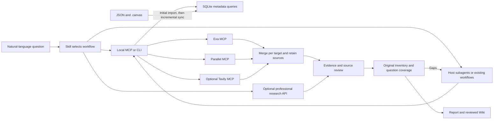

# Bookmark Research 0.4.0

**English** · [中文](README.zh.md)

[](#client-support) [](#client-support) [](#client-support) [](#client-support)

Query your [Bookmark Canvas](https://github.com/Browser-bookmark-hub/Bookmark-Canvas) data package in natural language, preserve its folder and card context, and research multiple targets through Exa, Parallel, and optional Tavily. **Codex, Claude Code, Pi, and DSH** share the same Skill and Python runtime, with a separate integration for each client.

**0.4.0** combines whole-package host workflows, optional research APIs, reviewed Wiki pages and evaluation with reusable source snapshots. It imports directories, ZIPs and individual cards, and monitors registered live directories while the MCP process runs. Stable source IDs survive new export paths. Full mirrors and partial exports use separate deletion rules. Research inventories and evidence remain frozen; changed input prompts research and Wiki review. English execution instructions have complete Chinese reading copies, and research output follows the user's language requirements.

Start with the **one-command Codex installer below**, or the **[installation guide](docs/installation.en.md)** for other clients and updates. The **[user guide](docs/user-guide.en.md)** covers first use, the three research modes, configuration and languages. The [releases page](https://github.com/Browser-bookmark-hub/Bookmark-Research/releases) lists published ZIPs and test packs; installation from Git does not require a release. The [design research](docs/research-0.2.0.md) retains the source-package research and first-party references. See [0.4.0 validation](docs/validation-0.4.0.md) for scope, source lifecycle, bilingual instructions, host/service boundaries and installation results.

## Install in Codex

With Bash, Git, Python 3.9+ with SQLite FTS5, and a Codex CLI that supports plugins:

```sh
curl -fsSL https://raw.githubusercontent.com/Browser-bookmark-hub/Bookmark-Research/main/install.sh | bash
```

The first install follows the repository's default branch, currently `main`. It fetches code directly from Git and delegates registration and verification to Codex's native plugin CLI; **no GitHub Release or ZIP download is required**. After installation, the terminal shows your effective settings, a first-use prompt, and a working command to view configuration. Start a new Codex thread to load the Skill and tools, then provide your own Bookmark Canvas package path.

Installer help and onboarding follow the system locale: Chinese locales select Chinese; other locales use English. Append `-s -- install --lang en` or `-s -- install --lang zh` to `bash` to choose explicitly. Ask research questions in either language or request a particular report language; original quotations are preserved.

The execution Skill and all 11 method references are maintained in English, with complete Chinese reading copies. The [instruction index](docs/instructions.en.md) links both versions and the full host prompt reference. Delegated research carries the task's output language; one shared Skill serves both languages.

**No configuration or API key is required for local bookmark queries.** The defaults use Exa + Parallel for web search, Exa for page reading, and automatic page archiving; web access depends on each provider's authentication and limits. Existing preferences are retained. See [first use and optional settings](docs/installation.en.md#first-use-and-data-locations).

```sh
# Update the registered source, then verify it
curl -fsSL https://raw.githubusercontent.com/Browser-bookmark-hub/Bookmark-Research/main/install.sh | bash -s -- update

# Preview a first install; --help lists all options
curl -fsSL https://raw.githubusercontent.com/Browser-bookmark-hub/Bookmark-Research/main/install.sh | bash -s -- --dry-run
```

To pin a **first installation** to the previously published v0.2.0 snapshot, append `-s -- install --ref v0.2.0` to `bash`. Repeat installs retain the registered ref; `update` refreshes that ref and does not switch a tag to a newer version. Historical versions retain their own features and onboarding language. See [installation options](docs/installation.en.md#one-command-codex-installation) for source conflicts and existing personal installations.

From a **checkout or extracted ZIP**, local installation is also available:

```sh
python3 scripts/install.py install
python3 scripts/install.py verify
```

For a local source, run `python3 scripts/install.py update` after updating its files. [Native commands and Git sources](docs/installation.en.md#local-checkout-or-zip) are also documented.

For **Claude Code, Pi, DSH**, or a downloaded ZIP, follow the [installation guide](docs/installation.en.md). The repository includes the Codex marketplace at [`.agents/plugins/marketplace.json`](.agents/plugins/marketplace.json).

## Included components

| Component | Included entry | Purpose |
| --- | --- | --- |
| **Skill** | [`skills/bookmark-research/SKILL.md`](skills/bookmark-research/SKILL.md) | Guides package reading, local queries, source verification, and research reports |
| **MCP server** | [`src/mcp_server.py`](src/mcp_server.py), started with `python3 src/cli.py serve` | One local `bookmark-research` server with the [shared tool catalog](#mcp-tools) |
| **Python CLI** | [`src/cli.py`](src/cli.py) | Runs the same queries and research workflows directly, including from Pi |
| **Web providers** | [`config/providers.json`](config/providers.json) and [`src/provider_adapters.py`](src/provider_adapters.py) | Exa, Parallel and optional Tavily behind one MCP; schema checks, session reuse and visible partial failures |
| **Research and coverage** | [`src/research.py`](src/research.py), [`src/research_coverage.py`](src/research_coverage.py) | Complete source inventory, all bookmark instances, budgets, evidence, substantive review and reports |
| **Host workflows** | [`hosts/`](hosts/) and [`src/routing.py`](src/routing.py) | Native Codex delegation, Claude workflow, Pi extension recipe and DSH workflow adapter |
| **Professional research** | [`src/research_services.py`](src/research_services.py) | Optional provider-owned background tasks, saved run IDs and secondary-report import |
| **Wiki and evaluation** | [`src/wiki.py`](src/wiki.py), [`src/evaluation.py`](src/evaluation.py) | Reviewed knowledge, immutable revisions, source/link lint and metrics from explicit labels |
| **Client integrations** | Native Codex manifest, [`install.sh`](install.sh), [`scripts/install.py`](scripts/install.py) and [`scripts/export_bundle.py`](scripts/export_bundle.py) | One-command install/update/verify in Codex; separate packages or adapters for other clients |

The runtime requires Python 3.9+ and SQLite with FTS5; `doctor` checks these requirements. It uses the Python standard library and does not require a separate database service.

## Client support

| Client | Skill | MCP / CLI | Plugin or package entry | Verification |
| --- | --- | --- | --- | --- |
| **Codex** | Included | MCP | ✓ Native [`.codex-plugin/plugin.json`](.codex-plugin/plugin.json) | Local 0.4.0 installation, 35-tool stdio runtime and source lifecycle checks passed; see [validation](docs/validation-0.4.0.md) |
| **Claude Code** | Included | MCP | ✓ Native plugin plus `workflows/bookmark-research.js` | Prerelease check: Claude 2.1.247 loaded the workflow and 34 MCP tools; the model endpoint returned 429 before execution |
| **Pi** | Included through `pi.skills` | CLI / stdio bridge | ✓ Skill package plus project workflow registrar | Isolated adapter scenarios; requires installed `pi-subagents` and `pi-subagents-workflows` |
| **DSH / DeepSeek Harness** | Configure Skill discovery separately | MCP through the official client | ✓ `cordis.patch.yml` plus workflow call generator | Isolated adapter scenarios; requires a configured workflow service, engine and tool |

✓ indicates an implemented package or adapter. It does not mean all four live clients completed a research task. Pi uses the existing extensions and a bundled Python stdio bridge; the plugin does not add a Pi execution engine. DSH requires `@deepseek-ai/dsh-mcp-client` and separate Skill discovery; its patch contains absolute paths and must be generated at the final installation location. See [host workflows](skills/bookmark-research/references/host-workflows.md) for invocation, cancellation and actual resume limits.

**Agent Plugins 1.0.0** is also available as a separate standard export: root `plugin.json` + `mcp.json`. It is a package format, not another client or the Codex native manifest. See [export formats](#export-formats) for commands and the [compatibility notes (Chinese)](docs/harness-compatibility.md) for first-party references and verification boundaries.

## Data and query model

Use packages that follow the Bookmark Canvas JSON schema. The plugin ships without bookmarks, registered sources, or a seed database. You provide the package path and research targets; a fresh data directory has no sources until the first `sync`.

**JSON / `.canvas` files are the source data; SQLite is a maintained, rebuildable query index.** Directory, ZIP and single-card imports save managed snapshots outside the originals. Partial imports retain omitted cards, and their snapshots include the combined data needed for recovery. Reimporting unchanged content preserves item IDs and reuses a saved version. Reuse `source_id` for a new export path of the same canvas; unrelated canvases are never merged by title or URL.

New ordinary exports default to `snapshot`, and Git directories to `live`; existing registrations retain their mode. Explicit `completeness=complete` reconciles a full mirror, while the default `partial` preserves omitted files. MCP runs a standard-library polling monitor for live directories (1-second checks, 2-second debounce, 5-second deletion grace). It stops with the host process, resumes on connection, and queries check changes too. No Git commands are run. Empty/unavailable directories and invalid writes preserve the previous index. Standalone CLI users can run `watch`. See [source lifecycles and recovery](skills/bookmark-research/references/source-lifecycle.md) for parameters and freshness states.



## Try it

In a session with the Skill loaded, ask:

> Analyze the bookmark package I provide. Search for the companies on my list and show which cards and folders contain them. Then use Exa and Parallel to find their official product information, combine the web results, and retain the sources.

For local queries, say "Search my bookmarks only; stay offline." For research, ask the agent to read key pages, investigate gaps, and save a report. For a longer investigation:

> Use the bookmarks in my selected group to compare these services. Save the selected bookmark context, break the comparison into research questions, investigate gaps and conflicting claims, and leave a report with traceable quotations and unresolved items. Preserve the task so I can continue later.

For a whole package:

> Research every original URL in this package. Use the available host subagents or workflow, preserve duplicate bookmark context, check conclusions independently, follow up missing sources, and save the report and reviewed Wiki with coverage details.

You can also run the same CLI from this directory without installing a client plugin. Replace the package path, `my-canvas` source name, and fictional company names:

```sh
python3 src/cli.py doctor
python3 src/cli.py sync /absolute/path/to/your-package --source-id my-canvas
python3 src/cli.py search my-canvas --target 'Example Company A' --target 'Example Company B' --section A --limit 5
python3 src/cli.py context my-canvas --section A
python3 src/cli.py search-web --target 'Example Company A official products' --target 'Example Company B official products' --limit 5
```

See the [CLI reference](skills/bookmark-research/references/cli.md) for commands and multiple-target input. The default database is `~/.local/share/bookmark-research/index.sqlite3`, respecting `XDG_DATA_HOME`. Override it with `BOOKMARK_RESEARCH_DATA_DIR` or the global `--db` option. Clients can share an index by using the same path. Keep it outside the source package and plugin cache.

## Capabilities

| Feature | Current behavior |
| --- | --- |
| Local search | Titles, URLs, tags, notes, and folder paths; filters by card, group, or subfolder; independent pagination per target |
| Canvas context | `descriptionMd`, `slot`, `label`, shared trees for copy cards, ancestor paths, geometric group membership, and connection direction |
| Source management | Directory/ZIP/single-card input, persistent path aliases, complete merged snapshots, version history and recovery |
| SQLite sync | Hash-based incremental updates, stable IDs, mirror/partial deletion rules, transactional rollback, process-scoped polling and pending/error states |
| Web search | Concurrent providers, URL merging within each target, RRF ranking, provenance, schema checks, cached tool discovery, classified errors and per-call usage |
| URL reading and archiving | Actual provider responses, recognized Markdown text, and source manifests; repeated reads add snapshots |
| Settings | Persistent providers, fetch/archive options, research methods/routes, optional professional services and Wiki directory |
| Complete package research | Frozen original URL inventory with every bookmark instance; separate accounted, accepted-text, substantive-review and question metrics |
| Deep research | Host workflows or optional professional APIs; durable evidence, idempotent operations, quotes, reviews, conflicts and reports |
| Wiki | Authored topic/entity pages with reviewed claim links, immutable revisions, body search and evidence/link lint |
| Evaluation | Answer precision/recall/F1, semantic citation labels, report rubric scores, coverage, cost/latency and repeat variance from explicit inputs |

Local search uses literal matching and SQL structure filters. It has no semantic retrieval or public BM25 ranking, although FTS5 tables are maintained. The model organizes company names and aliases into queries; bookmark counts are not company-entity counts.

This version has no embeddings, vector database or background page monitoring. Research sessions can be reloaded by ID. `fetch_web` archives actual responses by default; `wiki_write` separately organizes reviewed findings into knowledge pages. Simple queries do not trigger a library crawl; an explicit whole-package investigation keeps the complete input scope across all groups and rounds.

## Three research modes

| Need | Workflow | Output |
| --- | --- | --- |
| Quick lookup | Read a known URL, or search once to discover it | A concise sourced answer |
| Agentic search | The host plans queries, delegates independent work, reads pages and follows evidence gaps | An answer based on iterative retrieval |
| Deep research | Use host subagents/workflows, native research or an optional professional API; independently verify and follow gaps | A persistent research archive with original inventory, evidence, coverage, report and optional Wiki |

These modes follow [OpenAI's web search guide](https://developers.openai.com/api/docs/guides/tools-web-search). Having a URL does not determine whether a model reasons. `research_route` recommends an entrypoint from reported current tools and commands without launching it. Professional APIs have separate authentication and lifecycle contracts; anonymous Search MCP access does not authorize a Task API.

Read the [deep research guide](skills/bookmark-research/references/deep-research.md) for inputs and CLI examples. `research_start` freezes the complete indexed packages selected by `source_ids`; a subset requires explicit `scope_mode:"subset"`. Paginate `research_inventory` to the end. `bookmark_refs` identify focus items without silently narrowing whole-package scope.

`research_search` and `research_fetch` reserve retrieval attempts; repeating the same `operation_id` returns its recorded outcome. The default fetch budget accounts for the selected input size: 207 URLs require at least 26 full batches and receive 38 calls, within an 80-call limit. Explicit budgets are retained; insufficient capacity is reported without removing URLs. These controls do not measure or limit invisible host/model calls.

`research_source` reads saved text. Record content acceptance, quoted claims and each original URL's substantive judgment. A rejected source or retracted claim reopens affected questions. `research_coverage` reports gaps; `research_finish` refuses completion while original-source reviews, questions, conflicts or active/unknown external runs remain unresolved. Blocked and excluded sources remain visible in the original denominator. An `incomplete` report preserves the remaining work.

Quotations and hashes prove what text was saved. The model must still check that the provider returned the right page and that its content supports the claim. A successful fetch may contain excerpts, stale text, or a mismatched page. Source review and retrieval failures remain visible in the report.

Active tasks can continue directly. After exporting an `incomplete` report, use `research_record` with `kind:"resume"` and a reason; prior reports are preserved, and retrieval budgets and operation IDs carry forward. Completed and cancelled tasks remain closed. Status returns bounded previews; use section pagination for complete records.

`research_record` accepts either a single `entry` or up to 50 `entries` per call. Batches validate in order and save atomically, return compact IDs, and support safe retries with a stable `batch_id`. Use returned claim IDs for dependent records in later batches. `resume` and `external_run` remain single-entry operations; see [record types](skills/bookmark-research/references/deep-research.md#record-types).

[Professional service tools](skills/bookmark-research/references/research-services.md) prepare the exact brief/source payload, start once, observe the existing run, and archive its report. OpenAI cancellation is supported; Parallel cancellation is not established by this adapter. Unknown create outcomes are retained without resubmission. Imported reports remain secondary evidence and never mark all cited original URLs as read.

[Wiki and quality evaluation](docs/wiki-quality.md) track reviewed knowledge and measure supplied run results. Semantic citation accuracy requires actual reviewer labels. The included synthetic fixture demonstrates the scorer; it provides no evidence that a host, workflow or provider produces better research.

## Duplicate bookmarks, context, and result merging

**The same URL or folder name can exist independently in different contexts.** The index identifies bookmarks and folders by `source_id + section_id + item_id`; it does not delete or merge them by title or URL. Distinct items in the same `.json` file remain separate, as do items in different sections or sources. A page stored under both "Learning / References" and "Work / References" remains two bookmarks with their own folder identities, paths, notes, and tags. Indexing does not modify the original JSON / `.canvas` files.

- **Counts:** `bookmarks` counts bookmark instances. `unique_urls` counts distinct original URL strings; it is a statistic and does not reduce the stored records. Reports should state which count they use.
- **Permanent copy cards:** a `copy-anchor` shares its main tree according to the data format. Adding a view does not double the global bookmark count. The copy card's description, position, groups, and connections remain available through `get_context`.
- **Web results:** when Exa and Parallel find the same page for one research target, the results are combined while retaining each provider and query that found it. This reduces repeated display and repeated ranking contributions; search hits are not independent factual evidence. Different `target` labels are merged separately. Use labels such as "Learning / Product docs" and "Work / Product docs" to research contexts separately.

Duplicate item IDs within one section are identity conflicts and cause import failure with rollback. Distinct items sharing a name or URL are valid.

## Settings and page archives

Ask "Show the plugin settings," "Use only Exa for future searches," "Save page text to my knowledge directory," or "Read this page without archiving." The model uses `get_settings`, `update_settings`, or parameters for the current `fetch_web` call. There is no separate graphical settings page.

The default configuration file is `~/.config/bookmark-research/settings.json`, created on the first update. Page archives default to `~/.local/share/bookmark-research/knowledge/`; XDG and plugin data-directory environment variables are respected. You can choose your own absolute paths. These files live outside the plugin and canvas package, so plugin updates do not replace them.

With archiving enabled, received fetch responses create a snapshot directory: `response.json` stores the actual MCP response; `manifest.json` records URLs, provider, fetch time, response and text hashes, and status; `pages/<URL-hash>.md` stores successfully recognized text. Transport failures without a response return a classified error and no `result` or invented archive. Publication dates and authors are recorded separately. Conflicting responses for the same URL are retained and marked. Excerpts and unknown completeness are identified, and archive errors are returned with the fetch result. Later reads add snapshots without overwriting earlier ones.

```sh
python3 src/cli.py config show
python3 src/cli.py config set --search-provider exa --archive true
python3 src/cli.py fetch-web https://example.com --no-archive
```

See [settings and archives](skills/bookmark-research/references/settings-and-archive.md) for options, precedence, and archive structure. Automatic archiving applies to this plugin's `fetch_web` responses; it does not intercept other MCP tools in the host.

## Skill, MCP, and data rules

The [shared Skill](skills/bookmark-research/SKILL.md) guides the agent's workflow. The local **`bookmark-research` MCP server** executes queries and web operations. When a client uses the CLI, it runs the same underlying implementation.

### MCP tools

| Tool | Purpose |
| --- | --- |
| `index_status` | Inspect registered sources and index status |
| `sync_package` | Import a package or synchronize changes |
| `source_history` | List reusable source snapshots and recovery paths |
| `search_bookmarks` | Query bookmarks for multiple targets while retaining item context |
| `get_context` | Read section, card, group, connection, and item-ancestor context |
| `search_providers` | List configured web providers |
| `search_web` | Search through Exa / Parallel / Tavily and merge results per target |
| `fetch_web` | Read known URLs and optionally archive responses and page text |
| `get_settings` | Read current settings and storage paths |
| `update_settings` | Update persistent settings |
| `research_start` | Save a brief, questions, retrieval budget and optional bookmark references |
| `research_status` | List saved tasks, inspect bounded progress and paginate full records |
| `research_search` | Run and record a bounded search round with an idempotency key |
| `research_fetch` | Fetch selected URLs into the task's evidence archive |
| `research_source` | Read saved source text with hash verification and pagination |
| `research_record` | Save evidence and corrections singly or in atomic batches; resume incomplete reports |
| `research_finish` | Validate coverage and write a completed, incomplete or cancelled report |
| `research_inventory` / `research_coverage` | Paginate original sources and compare actual review against the complete frozen scope |
| `research_import_evidence` | Import actual host-read original text or explicitly secondary reports with provenance |
| `research_route` | Recommend a route using current host observations and saved preferences |
| `research_services` / `research_service_*` | Describe, prepare, start, observe, read, cancel, attach and import optional professional runs |
| `wiki_write` / `wiki_get` / `wiki_list` / `wiki_search` / `wiki_lint` | Maintain reviewed knowledge and immutable evidence-linked revisions |
| `evaluate_research` | Compute metrics from explicit tasks, outputs, measurements and reviewer labels |

### Web providers

| Provider or service | Integration |
| --- | --- |
| **Exa** | Built into the MCP server and CLI for search and URL reading |
| **Parallel** | Built into the MCP server and CLI for search and URL reading |
| **Tavily** | Optional built-in search/extract adapter; `TAVILY_API_KEY` uses Bearer, otherwise explicit keyless mode |
| **GitHub** | Use the host's existing GitHub MCP or `gh` for repository-specific tasks. No GitHub MCP is bundled; public pages can also be read through Exa / Parallel. |

All three providers run through the plugin's own MCP or CLI; additional host MCP registrations are unnecessary for these search and fetch tools. Defaults remain Exa and Parallel. Anonymous/keyless access and quotas depend on each service's policy; pass credentials through `EXA_API_KEY`, `PARALLEL_API_KEY`, or `TAVILY_API_KEY` in the launching environment. Local queries work offline.

`search_providers` describes configuration without network access; `probe:true` discovers actual tools and compatible schemas, without proving permission to execute them. Each MCP process reuses provider sessions and a bounded tool catalog. Tool calls are not automatically replayed after errors. See [MCP architecture and observed service behavior](docs/mcp-aggregation-0.2.0.md), including the initial Exa connection failure and its explicit follow-up verification.

### Package rules and AGENTS.md

Analysis rules are included in the Skill. The [package reading protocol](skills/bookmark-research/references/package-semantics.md) covers fields, metadata, A/B copies, chained sections, groups, connections, and counting. The [research workflow](skills/bookmark-research/references/research-workflow.md) covers web scope, evidence checks, and saved results. References retain their original guide sources and versions for future updates.

Routine analysis of supported formats does not require rereading the entire package `AGENTS.md`, and the runtime does not depend on it. Consult relevant original instructions for new formats, field conflicts, or package-specific conventions. Applicable directory instructions already loaded by the client still apply.

GitHub references and Git sync rules in a package's `AGENTS.md` do not automatically connect a GitHub service. See [GitHub and sync boundaries](skills/bookmark-research/references/github-and-sync.md).

The Skill currently produces answers and research reports. It does not generate importable bookmark packages or write changes back to source data. A future generation Skill could reuse the reading protocol with additional writing rules and validation.

## Export formats

This directory is the **Codex native plugin**, with its manifest at `.codex-plugin/plugin.json`. In Codex 0.153.4, the MCP configuration explicitly uses `cwd: "."` and runs `python3 src/cli.py serve` from the installed plugin directory. That native entry does not expand `${PLUGIN_ROOT}`; the Agent Plugins and Claude exports use their own path conventions.

The Codex manifest forwards these environment variable names through `env_vars`: `BOOKMARK_RESEARCH_DATA_DIR`, `BOOKMARK_RESEARCH_CONFIG`, `XDG_DATA_HOME`, `XDG_CONFIG_HOME`, `EXA_API_KEY`, `PARALLEL_API_KEY`, `TAVILY_API_KEY`, and `OPENAI_API_KEY`. Actual paths and credentials come from the user's runtime environment.

Run the relevant command **from this directory** to generate another format:

```sh
python3 scripts/export_bundle.py --format codex --output exports/codex/bookmark-research
python3 scripts/export_bundle.py --format claude --output exports/claude/bookmark-research
python3 scripts/export_bundle.py --format pi --output exports/pi/bookmark-research
python3 scripts/export_bundle.py --format dsh --output exports/dsh/bookmark-research
python3 scripts/export_bundle.py --format agent-plugin --output exports/agent-plugin/bookmark-research
```

The destination must be new or empty. Exports include their own English setup README with links to bundled Chinese and English user guides, and exclude indexes, caches, tests, and credentials. The exporter writes files; follow the generated README or [installation guide](docs/installation.en.md) to load them in your client.

- **Claude Code:** `.claude-plugin/plugin.json`, `.mcp.json` and a packaged Dynamic Workflow; load with `claude --plugin-dir <export-directory>`.
- **Pi:** `package.json` declares `pi.skills`; the Skill calls the CLI. Register the project workflow for the separately installed subagent extensions when available.
- **DSH:** an absolute-path patch for the official MCP client and a generator for `{meta,script,args}` accepted by its workflow tool. Configure Skill discovery and workflow components separately. A relocatable `dsh.bundle` package is not provided.
- **Agent Plugins 1.0.0:** root `plugin.json` + `mcp.json`, for clients implementing that specification; generated separately from Codex's native manifest.

See the [client support table](#client-support) for verification status and [compatibility notes (Chinese)](docs/harness-compatibility.md) for format differences and official sources.

## Development verification

The repository includes a synthetic [canvas test package](tests/fixtures/canvas) and behavioral tests for imports, provider contracts, research, installation and exports. Production ZIPs exclude developer tests; use the source checkout or the separate test pack for these commands. Tests do not contain the supplied personal bookmark packages.

From this plugin directory **in a full repository checkout**, developers can run:

```sh
python3 -m unittest discover -s tests -v
python3 scripts/verify_fixture.py --output /tmp/bookmark-research-verification
python3 scripts/verify_quality.py
python3 scripts/build_zip.py --output dist/bookmark-research-0.4.0.zip
python3 scripts/build_zip.py --include-tests --output dist/bookmark-research-test-pack-0.4.0.zip
```

The fixture verifier checks independent bookmark counts, copy-card semantics, scoped queries, unchanged source hashes, incremental sync, and a two-round research lifecycle with a failed page and resumed operation. To additionally validate your own package, append `--package /absolute/path/to/package`; this stays offline and writes derived files only to the new output directory.

Network verification is explicit: `python3 tests/live_provider_smoke.py --run-live --output /tmp/provider-smoke.json` makes at most three searches and three fetches. The [0.4.0 validation record](docs/validation-0.4.0.md) combines source lifecycle, whole-package research, bilingual instructions and host/service boundaries; [0.2.0](docs/validation-0.2.0.md) retains the earlier provider evidence.

The local stdio server exposes fixed tools. Its remote client implements the selected providers' Streamable HTTP lifecycle, bounded paginated tool discovery and limited session recovery; it is not a general OAuth client or a complete MCP SDK.

## Origin and license

Originally developed in [Bookmark Canvas](https://github.com/Browser-bookmark-hub/Bookmark-Canvas), this repository maintains the standalone research plugin. The original [GPL-3.0 license](LICENSE) is retained.
