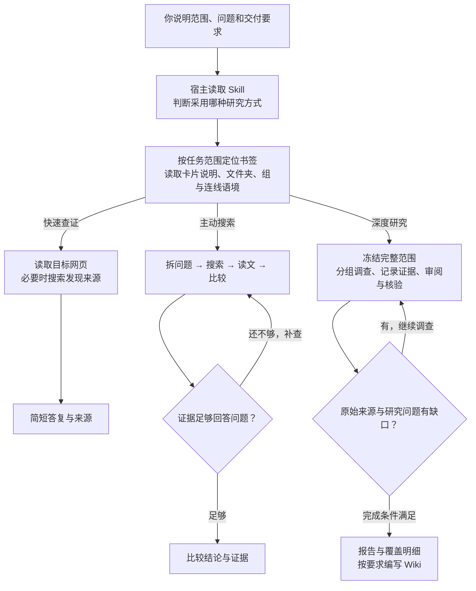
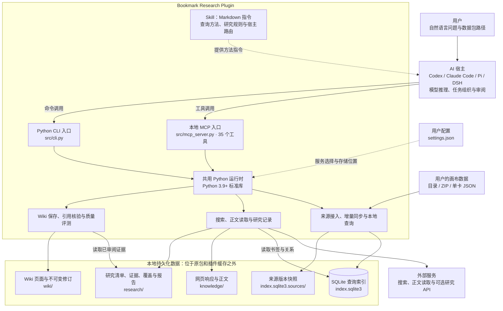
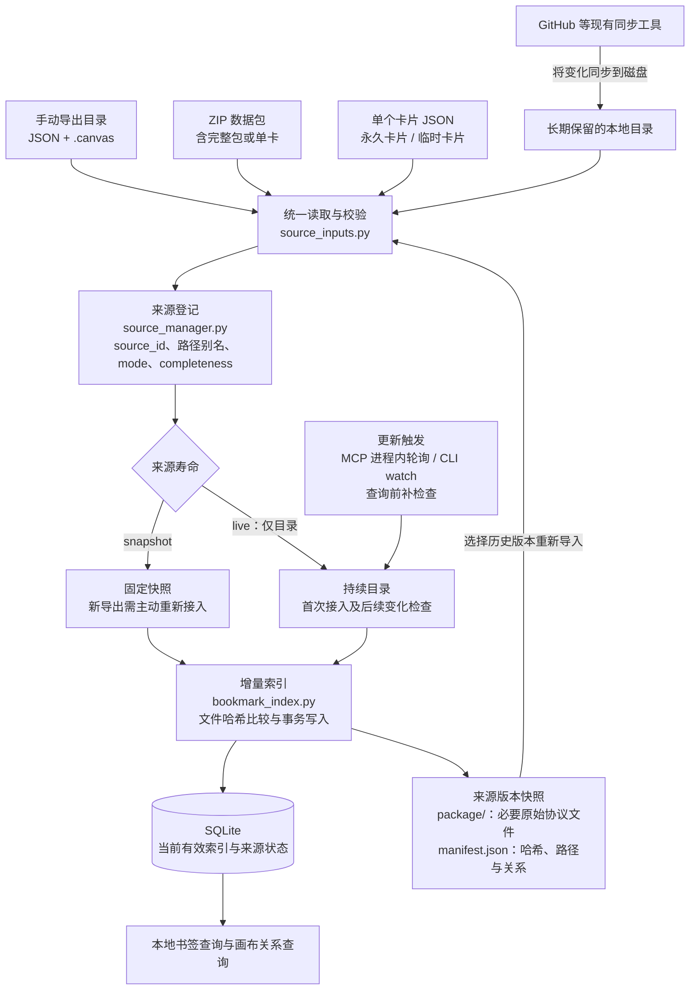

# Bookmark Research 0.4.0 结构图

用户可以直接用自然语言说明“查什么、查多大范围、要什么结果”，不用背固定提示词。安装并加载 Skill 后，由 Codex、Claude Code、Pi 或 DSH 理解请求，再调用插件工具执行。下面先看使用过程，再看内部结构。

| 研究方式 | 用户可以这样说 | 对书签／画布包怎样处理 | 交付 |
| --- | --- | --- | --- |
| ① 快速查证 `quick` | “打开包里 Exa 的官方文档，查一下它是否支持 MCP。” | 找到对应书签，读取已有 URL；找不到明确来源时，搜索后读取关键页。 | 简短答案与来源链接。 |
| ② 主动搜索 `agentic` | “比较我收藏的搜索服务，查清检索、正文读取和研究能力的区别。” | 读取相关卡片说明、书签和分组语境；拆出问题，搜索、读文、比较，再根据证据缺口补查。 | 带证据的比较与结论。 |
| ③ 深度研究 `deep` | “把整个 AI 调研包全量调查，核验排行榜，与我们的插件比较，交付报告和 Wiki。” | 冻结完整来源清单，按专题组织持续调查，保存证据，逐项审阅，检查遗漏与冲突后交付。 | 研究档案、覆盖明细、报告；按要求整理 Wiki。 |

第一行是插件的“快速查证”流程。[OpenAI 官方文档](https://developers.openai.com/api/docs/guides/tools-web-search)中的 **Non-reasoning** 指模型不进行主动的多轮搜索规划，并不要求用户已经有 URL。插件可以提供短流程，但不会把宿主模型自动切成非推理模型。Exa、Parallel、Tavily 是供这些流程使用的检索服务，不与三种研究深度一一对应。

默认 `research.depth=auto`：宿主根据任务判断深度，也可以遵循用户明确提出的“这次快速查证”或“这次深度研究”。`research_route` 只根据宿主报告的任务类型和可用工具建议入口；真正的工具调用、子代理启动或工作流执行由宿主发起。一般用户不需要手写这些参数。

深度研究有两条执行路线：宿主自身持续搜索、阅读、推理，必要时使用可用子代理／工作流；或者调用已启用并配置凭据的 OpenAI Deep Research API／Parallel Task API。插件实现了专业服务接口，但安装插件或在提示词里写“Deep Research”不会自动启用账户访问。实际是否可用，以当前配置和服务调用结果为准。特定宿主的专用命令，例如已加载的 Claude `/deep-research`，还要按该命令的调用方式启动。

交给专业服务时，插件把明确的研究问题与选定原 URL 整理成请求；画布语境由宿主用于构造问题，本机目录不会自动变成云端可读资料。服务返回的报告进入证据档案，所引原页仍需核验，不能用一份外部报告代替整包覆盖检查。

**研究深度与研究范围分别决定。** 只查一个书签就处理该书签；研究指定卡片就保留该卡片的范围；要求“研究整个包”时，默认保留整包全部原始 URL 和每个重复书签的语境。分批、子代理数量和搜索结果页数都不能缩小这个范围。深度研究中也会反复使用直接读取和主动搜索。

目录、ZIP 和单卡经过同一套接入程序。书签提供要读的 URL，卡片说明、文件夹、分组和连线提供研究语境；它们保存在本地索引中。仅问“某个书签在哪张卡片”时，查本地数据即可。接入包本身不会自动开始联网研究。

下面两张图对应当前 0.4.0 实现。宿主负责理解问题、模型推理、子代理或已有工作流；Plugin 提供安装封装，Skill 提供方法指令，Python 提供实际工具。CLI 和 MCP 共用同一套实现，也可以配置为共用本地数据。实线表示调用或数据流，虚线表示指令或配置影响。

各宿主的接入方式有所不同：Codex、Claude Code 使用 Skill + MCP；Pi 使用 Skill + CLI／stdio 桥，子代理工作流依赖已有扩展；DSH 使用 MCP 适配，并配置 Skill 发现和工作流服务。图中的宿主能力取决于实际安装与配置，适配实现及验证范围见[宿主支持说明](details.en.md#client-support)。

SQLite 是随 Python 工具读写的本地数据库文件，用来查询书签、栏目、文件夹和画布关系，并记录来源与同步状态。它可以从来源快照重建，不需要单独启动数据库服务器。

默认数据目录为 `~/.local/share/bookmark-research/`，默认配置文件为 `~/.config/bookmark-research/settings.json`。安装插件提供工具与默认设置；首次接入用户数据后才建立来源记录。本地查询无需 API 密钥，网络服务按各自的认证要求配置。

数据接入与同步的关键是把**输入载体**和**来源寿命**分开。单卡中的“永久／临时”是内容类型；`snapshot`／`live` 决定后续怎样更新。

新的普通导出默认使用 `snapshot`，Git 仓库内目录默认使用 `live`；已登记来源沿用原模式。同一画布换路径导出时显式沿用 `source_id`，以后记住路径别名；不同画布不会因标题或 URL 相同而合并。

两种模式都会保存版本快照。局部导入保留下来的旧栏目也进入快照，因此删除原下载包后仍可使用已接入的 snapshot，并能从保存的版本恢复。默认 `completeness=partial` 保留此次未提供的文件；明确指定 `complete` 才按完整镜像删除缺失文件。已提供栏目内删除的书签仍会同步，单卡固定使用 `partial`。

`live` 的后台检查跟随 MCP 进程：默认每 1 秒检查，普通变化稳定 2 秒后同步，整文件删除等待 5 秒。关闭进程后停止，重连和查询时补查。一次性 CLI 命令执行完即退出，持续监控需要运行前台 `watch`。Git 拉取、推送和登录由原有同步工具或宿主承担。

无效 JSON、目录暂时消失等情况会保留上次有效索引，并返回待更新或错误状态。这部分借鉴 CodeGraph 的增量更新和恢复机制，CodeGraph 本身不是运行依赖。详细参数与恢复命令见[来源生命周期说明](../skills/bookmark-research/references/source-lifecycle.md)。

普通书签查询和单个 URL 读取可以直接调用工具，无需先建立正式研究任务。正式全包研究中的搜索摘要、外部研究报告不能自动算作原始页面已读；覆盖不足时继续补查，或保存明确标记为未完成的报告。质量评测依据显式标注和运行数据，方法见[Wiki 与评测说明](wiki-quality.md)。

**自动更新的边界：`live` 目录在检查时同步本地索引，不会自动抓网页、调用 LLM 或改写 Wiki。** 研究状态检查会比较冻结输入与当前索引；发生变化时提示 `source_freshness.requires_review`，Wiki 读取／核验会标记 `needs_review`。宿主据此发起补充调查和修订，旧正文、研究清单与 Wiki 修订继续保留。
